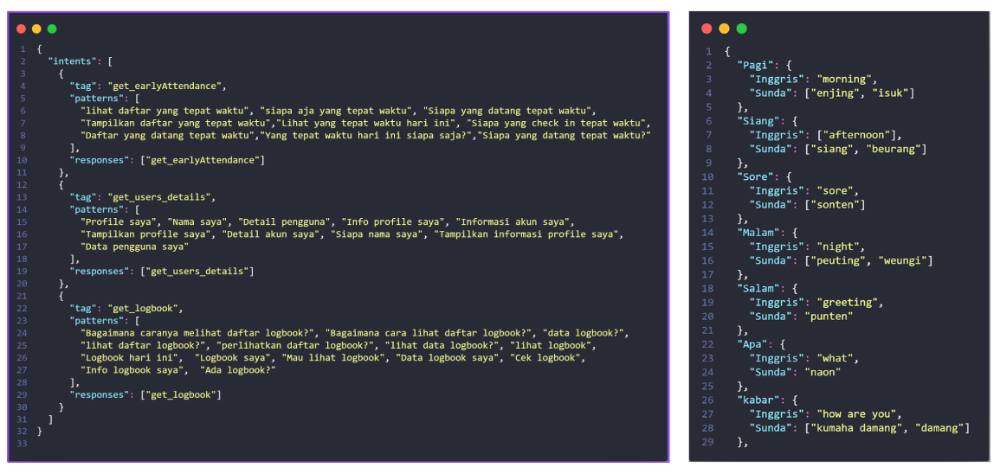
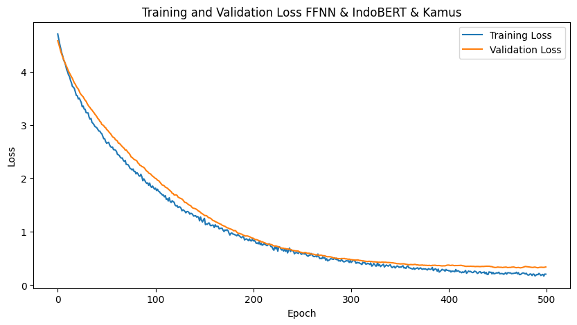
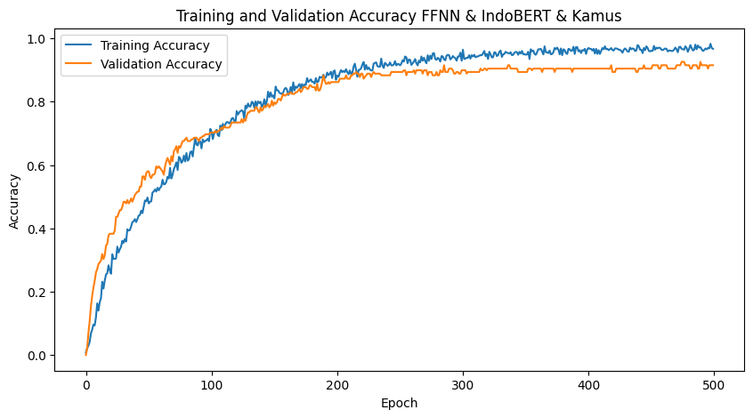
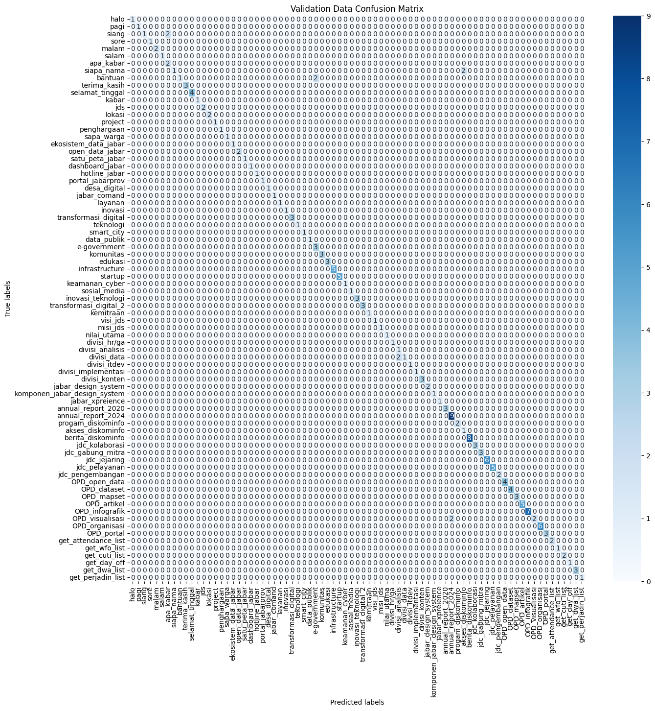
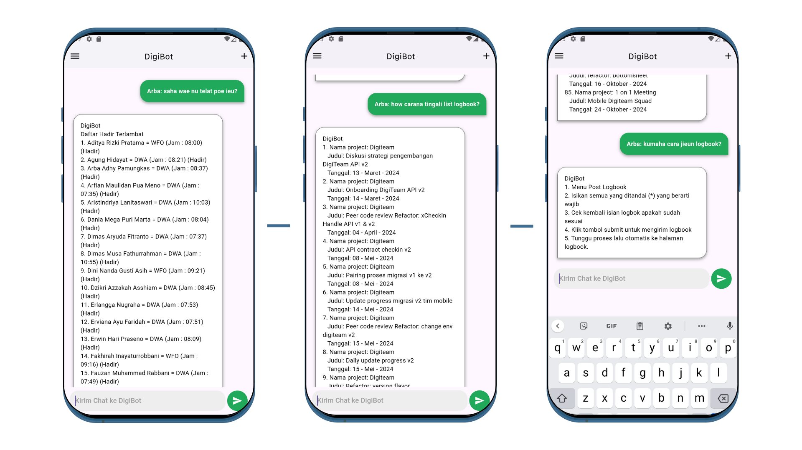

# Chatbot Multibahasa untuk Mobile

## Deskripsi
Proyek ini bertujuan untuk mengembangkan **chatbot multibahasa** untuk aplikasi **Mobile** dengan menggunakan model **Feed Forward Neural Network (FFNN)** dan **IndoBERT**. Chatbot ini mengintegrasikan **kamus multibahasa** untuk mendukung interaksi dalam **bahasa Indonesia, Sunda, dan Inggris**, memberikan respons yang cepat dan akurat. 

**Fitur Utama:**
- Integrasi kamus multibahasa yang memungkinkan chatbot untuk memahami dan merespons dalam tiga bahasa.
- Penggunaan model FFNN dan IndoBERT untuk meningkatkan pemahaman konteks kalimat.
- Implementasi dalam aplikasi mobile untuk memberikan akses informasi secara real-time dan data respons yang dikeluarkan dinamis karena terhubung dengan backend aplikasi.

## Tujuan
Chatbot ini dirancang untuk:
- Membantu pengguna aplikasi mobile mengakses informasi secara cepat dan akurat dalam lingkungan kerja multibahasa.
- Meningkatkan efisiensi operasional dengan memberikan respons yang relevan dan tepat waktu.

## Metodologi
Proyek ini mengikuti metodologi **CRISP-DM** (Cross-Industry Standard Process for Data Mining), yang terdiri dari enam tahapan utama sebagai berikut:

1. **Business Understanding**  
   Identifikasi kebutuhan pengguna DigiTeam untuk meningkatkan operasional pekerjaan melalui chatbot multibahasa yang responsif dan akurat.

2. **Data Understanding**  
   Pengumpulan data dari pertanyaan pengguna yang meliputi topik seperti manajemen proyek dan status tugas, dengan keberagaman bahasa (Indonesia, Inggris, Sunda).

3. **Data Preparation**  
   Pembersihan data dengan *case folding*, *stop word removal*, *stemming*, *tokenisasi*, dan integrasi kamus multibahasa untuk memperkaya pemahaman model.

4. **Modeling**  
   Pengembangan model **FFNN** dan **IndoBERT**, dilatih dengan 80% data pelatihan dan 20% data pengujian, menggunakan optimizer **Adam** dan **cross-entropy loss**.

5. **Evaluation**  
   Evaluasi model dengan metrik akurasi, presisi, recall, dan F1-score, baik dengan maupun tanpa integrasi kamus multibahasa.

6. **Deployment**  
   Integrasi model chatbot ke dalam aplikasi DigiTeam menggunakan pendekatan Agile untuk pengembangan iteratif dan akses data real-time dan dinamis.

# PERINGATAN !!!
Harap dicatat bahwa data yang terdapat dalam repository ini hanya merupakan **contoh** dan **bukan data asli**. Data ini digunakan semata-mata untuk tujuan demonstrasi dan pengembangan model chatbot multibahasa. Pengguna tidak disarankan untuk menggunakan data ini untuk tujuan lain selain pengembangan dan pembelajaran.

Jika Anda berencana menggunakan data ini untuk proyek lain, harap pastikan untuk mengganti dataset dengan data yang relevan dan valid. Semua data yang ada di repositori ini tidak mewakili informasi atau data dari pengguna atau sistem yang sebenarnya.

## Dataset dan Integrasi Kamus Multibahasa
Dataset yang digunakan dalam proyek ini terdiri dari dua komponen utama:
1. **Dataset Intens**: Dataset ini mencakup contoh percakapan dalam berbagai konteks yang relevan dengan aplikasi mobile, seperti logbook, profil pengguna, dan data kehadiran.
2. **Kamus Multibahasa**: Kamus ini berisi **309 kata** yang mencakup terjemahan dan sinonim dalam bahasa Indonesia, Sunda, dan Inggris. Kamus ini digunakan untuk meningkatkan pemahaman model terhadap variasi bahasa yang digunakan oleh pengguna.

Dataset ini digunakan untuk melatih model chatbot sehingga dapat mengidentifikasi berbagai macam pertanyaan dan memberikan respons yang sesuai dalam berbagai bahasa. Selain itu, dataset juga memastikan bahwa chatbot dapat menangani percakapan dalam konteks multibahasa tanpa kehilangan akurasi.

### Dataset Intens dan Kamus:
  

## Hasil

**Model tanpa Kamus Multibahasa**:
- **Akurasi**: 67,02%
- **Presisi**: 67,87%
- **Recall**: 67,02%
- **F1-Score**: 65,72%

### Train dan Validation Loss (Tanpa Kamus)

| **Epoch** | **Loss** | **Train Accuracy** | **Val Loss** | **Val Accuracy** |
|-----------|----------|--------------------|--------------|------------------|
| 100/500   | 2.6525   | 0.4786             | 3.2234       | 0.3723           |
| 200/500   | 1.7144   | 0.7086             | 2.5788       | 0.5213           |
| 300/500   | 1.1561   | 0.8289             | 2.0808       | 0.5957           |
| 400/500   | 0.7984   | 0.8850             | 1.7010       | 0.6702           |
| 500/500   | 0.5564   | 0.9332             | 1.4565       | 0.6702           |

**Model dengan Integrasi Kamus Multibahasa**:
- **Akurasi**: 91,49%
- **Presisi**: 93,35%
- **Recall**: 91,49%
- **F1-Score**: 90,61%

### Train dan Validation Loss (Dengan Kamus)

| **Epoch** | **Loss** | **Train Accuracy** | **Val Loss** | **Val Accuracy** |
|-----------|----------|--------------------|--------------|------------------|
| 100/500   | 1.7980   | 0.7139             | 2.0121       | 0.7021           |
| 200/500   | 0.8652   | 0.8690             | 0.8832       | 0.8617           |
| 300/500   | 0.4622   | 0.9291             | 0.4819       | 0.8989           |
| 400/500   | 0.2796   | 0.9652             | 0.3769       | 0.9043           |
| 500/500   | 0.2063   | 0.9666             | 0.3420       | 0.9149           |

Integrasi kamus multibahasa secara signifikan meningkatkan kemampuan model dalam memahami dan merespons variasi bahasa, menghasilkan **akurasi respons yang lebih tinggi** dan **pengurangan kesalahan klasifikasi**.

### Grafik Hasil Pelatihan:

### Grafik Akurasi:
 

### Confusion Matrix dengan integrasi kamus multibahasa :

### Contoh Input dan Respons
**Threshold**: Model hanya memberikan respons yang dianggap valid jika probabilitas prediksi tag lebih dari **0.75**. Prediksi dengan probabilitas lebih rendah dari 0.75 dianggap tidak valid atau tidak pasti.

Berikut adalah contoh perbandingan input asli dan terjemahan, bersama dengan probabilitas dan tag yang diprediksi oleh model:
| **No.** | **Input (Tanpa Kamus)**            | **Probabilitas (Tanpa Kamus)** | **Tag (Tanpa Kamus)** | **Terjemahan**             | **Probabilitas (Dengan Kamus)** | **Tag (Dengan Kamus)** |  
|---------|-------------------------------------|---------------------------------|------------------------|---------------------------------------|---------------------------------|-------------------------|  
| 1       | *How Carana Tingali List Logbook?*  | 0.4526                          | post_logbook            | *Gimana Cara Lihat Daftar Logbook?*   | 0.9965                          | get_logbook             |  
| 2       | *Saha Wae Nu Telat Poe Ieu ?*      | 0.1554                          | satu_data_jabar         | *Siapa saja Yang Telat Hari Ini?*        | 0.9742                          | get_lateAttendance      |  
| 3       | *Tampilkan embaran profile saya*   | 0.2480                          | get_users_details       | *Perlihatkan Informasi Profile Saya*     | 0.9967                          | get_users_details       |  

### Penjelasan:
1. **Input (Tanpa Kamus)**: Kalimat yang dimasukkan oleh pengguna tanpa melalui proses penerjemahan menggunakan kamus multibahasa.
2. **Probabilitas (Tanpa Kamus)**: Probabilitas model dalam memberikan respons berdasarkan input asli tanpa bantuan kamus.
3. **Tag (Tanpa Kamus)**: Tag yang diprediksi oleh model berdasarkan input asli.
4. **Terjemahan**: Kalimat yang telah diterjemahkan atau dimodifikasi dengan menggunakan kamus multibahasa untuk meningkatkan pemahaman model terhadap variasi bahasa.
5. **Probabilitas (Dengan Kamus)**: Probabilitas model dalam memberikan respons setelah penerjemahan dengan kamus multibahasa.
6. **Tag (Dengan Kamus)**: Tag yang diprediksi oleh model setelah penerjemahan dan pengolahan dengan kamus multibahasa.

Proses terjemahan meningkatkan probabilitas prediksi karena model lebih mudah memahami kata-kata yang sesuai dengan pola dalam data pelatihan. Dengan sinonim yang lebih dikenal dan struktur kalimat yang lebih sederhana, model dapat memberikan respons yang lebih akurat dan kontekstual, sehingga hasil akhir lebih relevan dan meyakinkan.

## Implementasi ke Dalam Aplikasi Mobile

Chatbot multibahasa yang dikembangkan telah diintegrasikan ke dalam aplikasi mobile. Integrasi ini memungkinkan pengguna untuk berinteraksi dengan chatbot secara langsung dalam aplikasi, sehingga memberikan pengalaman yang seamless dalam mengakses informasi. 

**Fitur utama implementasi:**
1. **Antarmuka Pengguna:** Tampilan yang user-friendly dengan dukungan untuk percakapan real-time.
2. **Kemampuan Multibahasa:** Chatbot dapat memahami input dalam bahasa Indonesia, Sunda, dan Inggris.
3. **Respons Dinamis:** Data yang dihasilkan oleh chatbot bersifat real-time dan terhubung langsung dengan backend aplikasi.
4. **Optimasi Proses:** Penerapan model dengan dukungan kamus multibahasa memastikan kecepatan dan akurasi tinggi dalam memberikan jawaban.

### Contoh Tampilan Implementasi

Berikut adalah tampilan implementasi chatbot multibahasa dalam aplikasi mobile:

### Penjelasan
Gambar di atas menunjukkan integrasi chatbot ke dalam aplikasi mobile dengan fitur utama sebagai berikut:
- **Input Percakapan:** Pengguna dapat mengetik pertanyaan dalam bahasa Indonesia, Sunda, atau Inggris.
- **Output Respons:** Chatbot memberikan jawaban sesuai konteks pertanyaan dengan tingkat akurasi yang tinggi.
- **Respons Real-Time Dinamis:** Chatbot dapat memberikan respons yang disesuaikan dengan pengguna yang login, termasuk memanfaatkan data-data operasional yang relevan milik pengguna untuk memberikan jawaban yang lebih personal dan kontekstual.

Integrasi ini tidak hanya meningkatkan pengalaman pengguna tetapi juga memastikan efisiensi dalam komunikasi berbasis data di lingkungan kerja multibahasa.

## Kesimpulan
Proyek ini berhasil mengembangkan **chatbot multibahasa** untuk aplikasi Mobile yang dapat menangani percakapan dalam bahasa Indonesia, Sunda, dan Inggris dengan efektif. Penggunaan **model FFNN** dan **IndoBERT** yang dipadukan dengan **kamus multibahasa** memungkinkan chatbot untuk memberikan respons yang relevan dan tepat waktu, meningkatkan efisiensi operasional dalam lingkungan kerja multibahasa.

Integrasi kamus multibahasa terbukti memberikan **peningkatan akurasi yang signifikan**, memungkinkan chatbot untuk memahami dan merespons variasi bahasa pengguna dengan lebih baik. Hasil pengujian menunjukkan bahwa model yang menggunakan kamus multibahasa mampu mencapai **akurasi sebesar 91,49%**, jauh lebih baik dibandingkan dengan model tanpa kamus yang hanya mencapai **67,02%**.

Dengan penerapan teknologi ini, diharapkan aplikasi mobile dapat lebih optimal dalam mendukung interaksi pengguna dari berbagai latar belakang bahasa, serta meningkatkan produktivitas dan efektivitas dalam pengambilan keputusan yang berbasis data.
